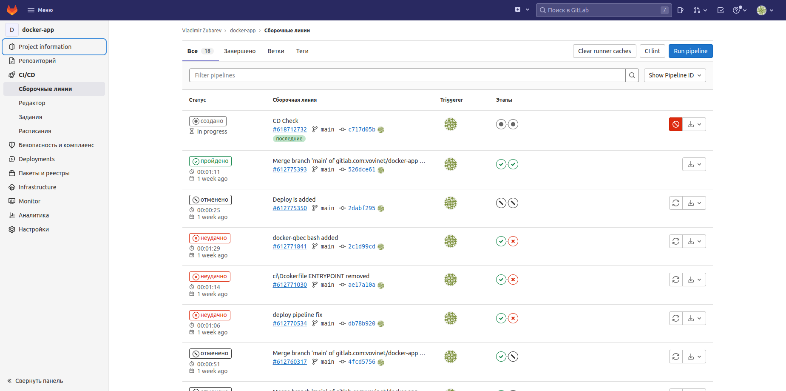

# Описание выполнения дипломного блока

## Этапы выполнения:

1. Создание облачной инфраструктуры
2. Создание Kubernetes кластера
3. Создание тестового приложения
4. Подготовка cистемы мониторинга и деплой приложения
5. Установка и настройка CI/CD

## Описание процесса выполнения.

### 1. Создание облачной инфраструктуры

 - применен метод представления "инфраструктура как код". [Репозиторий](https://github.com/vovinet/infra-ft-cloud) с описанием инфраструктуры.
 - управление инфраструктурой реализовано посредством [terraform cloud](https://app.terraform.io/app/vovinet-netology/workspaces)
 - настроено автоматическое планирование и применение изменений по коммиту в репозиторий.

Скриншоты Terrafom Cloud:


Скриншот Yandex.Cloud:


Успешный статус применения таже видно в [репозитории](https://github.com/vovinet/infra-ft-cloud) на GitHub (аккаунт связан с Terraform Cloud).

Работа с облаком производится посредством создания сервисной учётной записи c ролью compute.admin, создание iam token и назначение на калог для размещения ресурсов:
yc iam key create --service-account-name stage-sa

Обновить IAM-токен (действует до 12 часов): ```yc iam create-token```

Полученный токен используется Terrafom Cloud с помощью Variables Set


Работаю с одним окружением, т.к. упираюсь в лимиты:
```
ResourceExhausted desc = Quota limit vpc.externalStaticAddresses.count exceeded
```

  
### 2. Создание Kubernetes кластера

 - Kubernetes-кластер развернут с помощью [kubespray](https://github.com/kubernetes-sigs/kubespray). Использованные [инвентари](conf/kubespray/)

 ```
PLAY RECAP **************************************************************************************************************************************************************************************************
cp1                        : ok=748  changed=142  unreachable=0    failed=0    skipped=1247 rescued=0    ignored=9   
localhost                  : ok=3    changed=0    unreachable=0    failed=0    skipped=0    rescued=0    ignored=0   
node1                      : ok=474  changed=87   unreachable=0    failed=0    skipped=729  rescued=0    ignored=2   
node2                      : ok=474  changed=87   unreachable=0    failed=0    skipped=729  rescued=0    ignored=2   
node3                      : ok=474  changed=87   unreachable=0    failed=0    skipped=729  rescued=0    ignored=2   

Воскресенье 21 августа 2022  13:04:08 +0300 (0:00:00.084)       0:17:31.543 *** 
=============================================================================== 
download : download_file | Validate mirrors --------------------------------------------------------------------------------------------------------------------------------------------------------- 42.57s
kubernetes/kubeadm : Join to cluster ---------------------------------------------------------------------------------------------------------------------------------------------------------------- 34.74s
kubernetes/preinstall : Install packages requirements ----------------------------------------------------------------------------------------------------------------------------------------------- 32.46s
kubernetes/control-plane : kubeadm | Initialize first master ---------------------------------------------------------------------------------------------------------------------------------------- 29.60s
kubernetes-apps/ansible : Kubernetes Apps | Start Resources ----------------------------------------------------------------------------------------------------------------------------------------- 21.47s
kubernetes-apps/ansible : Kubernetes Apps | Lay Down CoreDNS templates ------------------------------------------------------------------------------------------------------------------------------ 20.39s
download : download_container | Download image if required ------------------------------------------------------------------------------------------------------------------------------------------ 15.77s
kubernetes/preinstall : Preinstall | wait for the apiserver to be running --------------------------------------------------------------------------------------------------------------------------- 15.28s
download : download_container | Download image if required ------------------------------------------------------------------------------------------------------------------------------------------ 13.73s
network_plugin/calico : Calico | Create calico manifests -------------------------------------------------------------------------------------------------------------------------------------------- 12.39s
network_plugin/calico : Wait for calico kubeconfig to be created ------------------------------------------------------------------------------------------------------------------------------------ 11.25s
download : download_container | Download image if required ------------------------------------------------------------------------------------------------------------------------------------------ 11.15s
kubernetes/preinstall : Update package management cache (APT) --------------------------------------------------------------------------------------------------------------------------------------- 10.83s
etcd : reload etcd ---------------------------------------------------------------------------------------------------------------------------------------------------------------------------------- 10.17s
network_plugin/calico : Start Calico resources ------------------------------------------------------------------------------------------------------------------------------------------------------ 10.11s
download : download_container | Download image if required ------------------------------------------------------------------------------------------------------------------------------------------- 8.85s
download : download_container | Download image if required ------------------------------------------------------------------------------------------------------------------------------------------- 7.95s
download : download_container | Download image if required ------------------------------------------------------------------------------------------------------------------------------------------- 7.32s
download : download_container | Download image if required ------------------------------------------------------------------------------------------------------------------------------------------- 7.30s
container-engine/containerd : download_file | Download item ------------------------------------------------------------------------------------------------------------------------------------------ 6.55s

```

После копирования и редиктирования конфига подключимся к кластеру с локальной машины:
```
$ kubectl cluster-info 
Kubernetes control plane is running at https://51.250.2.8:6443

To further debug and diagnose cluster problems, use 'kubectl cluster-info dump'.

$ kubectl get po -A -o wide
NAMESPACE     NAME                              READY   STATUS    RESTARTS      AGE   IP             NODE    NOMINATED NODE   READINESS GATES
kube-system   calico-node-2bmpm                 1/1     Running   0             12m   10.0.0.11      node1   <none>           <none>
kube-system   calico-node-bml7z                 1/1     Running   0             12m   10.0.0.10      cp1     <none>           <none>
kube-system   calico-node-dh7rv                 1/1     Running   0             12m   10.0.0.13      node3   <none>           <none>
kube-system   calico-node-jvtcz                 1/1     Running   0             12m   10.0.0.12      node2   <none>           <none>
kube-system   coredns-666959ff67-m7bzq          1/1     Running   0             11m   10.233.110.1   cp1     <none>           <none>
kube-system   coredns-666959ff67-rtm25          1/1     Running   0             11m   10.233.90.1    node1   <none>           <none>
kube-system   dns-autoscaler-59b8867c86-rwkqp   1/1     Running   0             11m   10.233.110.2   cp1     <none>           <none>
kube-system   kube-apiserver-cp1                1/1     Running   1             14m   10.0.0.10      cp1     <none>           <none>
kube-system   kube-controller-manager-cp1       1/1     Running   2 (10m ago)   14m   10.0.0.10      cp1     <none>           <none>
kube-system   kube-proxy-2xkd9                  1/1     Running   0             13m   10.0.0.12      node2   <none>           <none>
kube-system   kube-proxy-d6flt                  1/1     Running   0             13m   10.0.0.11      node1   <none>           <none>
kube-system   kube-proxy-m2b84                  1/1     Running   0             14m   10.0.0.10      cp1     <none>           <none>
kube-system   kube-proxy-xvqs2                  1/1     Running   0             13m   10.0.0.13      node3   <none>           <none>
kube-system   kube-scheduler-cp1                1/1     Running   2 (10m ago)   14m   10.0.0.10      cp1     <none>           <none>
kube-system   nodelocaldns-5vvhm                1/1     Running   0             10m   10.0.0.11      node1   <none>           <none>
kube-system   nodelocaldns-85j7j                1/1     Running   0             10m   10.0.0.13      node3   <none>           <none>
kube-system   nodelocaldns-87hpn                1/1     Running   0             10m   10.0.0.10      cp1     <none>           <none>
kube-system   nodelocaldns-bl6gf                1/1     Running   0             10m   10.0.0.12      node2   <none>           <none>
```

### 3. Создание тестового приложения

В качестве тестового приложения был выбран nginx, отдающий тестовую страницу. Репозиторий с Dockerfile, конфигом, отдаваемым контентом и пайплайном ci доступны в [репозитории](https://gitlab.com/vovinet/docker-app)  
Скриншот репозитория, на нём также видно отметку об успешной сборке.


Реестр контейнеров:
```
https://gitlab.com/vovinet/docker-app/container_registry/
```


### 4. Подготовка cистемы мониторинга и деплой приложения

4.1. Развертывание системы мониторинга

Клонируем репозиторий
```
$ git clone git@github.com:prometheus-operator/kube-prometheus.git 
```

Переходим в склонированный каталог и развертываем контейнеры:
```
$ kubectl apply --server-side -f manifests/setup
customresourcedefinition.apiextensions.k8s.io/alertmanagerconfigs.monitoring.coreos.com serverside-applied
customresourcedefinition.apiextensions.k8s.io/alertmanagers.monitoring.coreos.com serverside-applied
customresourcedefinition.apiextensions.k8s.io/podmonitors.monitoring.coreos.com serverside-applied
customresourcedefinition.apiextensions.k8s.io/probes.monitoring.coreos.com serverside-applied
customresourcedefinition.apiextensions.k8s.io/prometheuses.monitoring.coreos.com serverside-applied
customresourcedefinition.apiextensions.k8s.io/prometheusrules.monitoring.coreos.com serverside-applied
customresourcedefinition.apiextensions.k8s.io/servicemonitors.monitoring.coreos.com serverside-applied
customresourcedefinition.apiextensions.k8s.io/thanosrulers.monitoring.coreos.com serverside-applied
namespace/monitoring serverside-applied
$ until kubectl get servicemonitors --all-namespaces ; do date; sleep 1; echo ""; done
No resources found
$ kubectl apply -f manifests/
alertmanager.monitoring.coreos.com/main created
networkpolicy.networking.k8s.io/alertmanager-main created
poddisruptionbudget.policy/alertmanager-main created
prometheusrule.monitoring.coreos.com/alertmanager-main-rules created
secret/alertmanager-main created
service/alertmanager-main created
serviceaccount/alertmanager-main created
servicemonitor.monitoring.coreos.com/alertmanager-main created
clusterrole.rbac.authorization.k8s.io/blackbox-exporter created
clusterrolebinding.rbac.authorization.k8s.io/blackbox-exporter created
configmap/blackbox-exporter-configuration created
deployment.apps/blackbox-exporter created
networkpolicy.networking.k8s.io/blackbox-exporter created
service/blackbox-exporter created
serviceaccount/blackbox-exporter created
servicemonitor.monitoring.coreos.com/blackbox-exporter created
secret/grafana-config created
secret/grafana-datasources created
configmap/grafana-dashboard-alertmanager-overview created
configmap/grafana-dashboard-apiserver created
configmap/grafana-dashboard-cluster-total created
configmap/grafana-dashboard-controller-manager created
configmap/grafana-dashboard-grafana-overview created
configmap/grafana-dashboard-k8s-resources-cluster created
configmap/grafana-dashboard-k8s-resources-namespace created
configmap/grafana-dashboard-k8s-resources-node created
configmap/grafana-dashboard-k8s-resources-pod created
configmap/grafana-dashboard-k8s-resources-workload created
configmap/grafana-dashboard-k8s-resources-workloads-namespace created
configmap/grafana-dashboard-kubelet created
configmap/grafana-dashboard-namespace-by-pod created
configmap/grafana-dashboard-namespace-by-workload created
configmap/grafana-dashboard-node-cluster-rsrc-use created
configmap/grafana-dashboard-node-rsrc-use created
configmap/grafana-dashboard-nodes-darwin created
configmap/grafana-dashboard-nodes created
configmap/grafana-dashboard-persistentvolumesusage created
configmap/grafana-dashboard-pod-total created
configmap/grafana-dashboard-prometheus-remote-write created
configmap/grafana-dashboard-prometheus created
configmap/grafana-dashboard-proxy created
configmap/grafana-dashboard-scheduler created
configmap/grafana-dashboard-workload-total created
configmap/grafana-dashboards created
deployment.apps/grafana created
networkpolicy.networking.k8s.io/grafana created
prometheusrule.monitoring.coreos.com/grafana-rules created
service/grafana created
serviceaccount/grafana created
servicemonitor.monitoring.coreos.com/grafana created
prometheusrule.monitoring.coreos.com/kube-prometheus-rules created
clusterrole.rbac.authorization.k8s.io/kube-state-metrics created
clusterrolebinding.rbac.authorization.k8s.io/kube-state-metrics created
deployment.apps/kube-state-metrics created
networkpolicy.networking.k8s.io/kube-state-metrics created
prometheusrule.monitoring.coreos.com/kube-state-metrics-rules created
service/kube-state-metrics created
serviceaccount/kube-state-metrics created
servicemonitor.monitoring.coreos.com/kube-state-metrics created
prometheusrule.monitoring.coreos.com/kubernetes-monitoring-rules created
servicemonitor.monitoring.coreos.com/kube-apiserver created
servicemonitor.monitoring.coreos.com/coredns created
servicemonitor.monitoring.coreos.com/kube-controller-manager created
servicemonitor.monitoring.coreos.com/kube-scheduler created
servicemonitor.monitoring.coreos.com/kubelet created
clusterrole.rbac.authorization.k8s.io/node-exporter created
clusterrolebinding.rbac.authorization.k8s.io/node-exporter created
daemonset.apps/node-exporter created
networkpolicy.networking.k8s.io/node-exporter created
prometheusrule.monitoring.coreos.com/node-exporter-rules created
service/node-exporter created
serviceaccount/node-exporter created
servicemonitor.monitoring.coreos.com/node-exporter created
clusterrole.rbac.authorization.k8s.io/prometheus-k8s created
clusterrolebinding.rbac.authorization.k8s.io/prometheus-k8s created
networkpolicy.networking.k8s.io/prometheus-k8s created
poddisruptionbudget.policy/prometheus-k8s created
prometheus.monitoring.coreos.com/k8s created
prometheusrule.monitoring.coreos.com/prometheus-k8s-prometheus-rules created
rolebinding.rbac.authorization.k8s.io/prometheus-k8s-config created
rolebinding.rbac.authorization.k8s.io/prometheus-k8s created
rolebinding.rbac.authorization.k8s.io/prometheus-k8s created
rolebinding.rbac.authorization.k8s.io/prometheus-k8s created
role.rbac.authorization.k8s.io/prometheus-k8s-config created
role.rbac.authorization.k8s.io/prometheus-k8s created
role.rbac.authorization.k8s.io/prometheus-k8s created
role.rbac.authorization.k8s.io/prometheus-k8s created
service/prometheus-k8s created
serviceaccount/prometheus-k8s created
servicemonitor.monitoring.coreos.com/prometheus-k8s created
apiservice.apiregistration.k8s.io/v1beta1.metrics.k8s.io created
clusterrole.rbac.authorization.k8s.io/prometheus-adapter created
clusterrole.rbac.authorization.k8s.io/system:aggregated-metrics-reader created
clusterrolebinding.rbac.authorization.k8s.io/prometheus-adapter created
clusterrolebinding.rbac.authorization.k8s.io/resource-metrics:system:auth-delegator created
clusterrole.rbac.authorization.k8s.io/resource-metrics-server-resources created
configmap/adapter-config created
deployment.apps/prometheus-adapter created
networkpolicy.networking.k8s.io/prometheus-adapter created
poddisruptionbudget.policy/prometheus-adapter created
rolebinding.rbac.authorization.k8s.io/resource-metrics-auth-reader created
service/prometheus-adapter created
serviceaccount/prometheus-adapter created
servicemonitor.monitoring.coreos.com/prometheus-adapter created
clusterrole.rbac.authorization.k8s.io/prometheus-operator created
clusterrolebinding.rbac.authorization.k8s.io/prometheus-operator created
deployment.apps/prometheus-operator created
networkpolicy.networking.k8s.io/prometheus-operator created
prometheusrule.monitoring.coreos.com/prometheus-operator-rules created
service/prometheus-operator created
serviceaccount/prometheus-operator created
servicemonitor.monitoring.coreos.com/prometheus-operator created
$ kubectl get po -n monitoring -o wide
NAME                                   READY   STATUS    RESTARTS   AGE     IP            NODE     NOMINATED NODE   READINESS GATES
alertmanager-main-0                    2/2     Running   0          3m7s    10.233.90.8   node1    <none>           <none>
alertmanager-main-1                    2/2     Running   0          3m7s    10.233.90.9   node1    <none>           <none>
alertmanager-main-2                    0/2     Pending   0          3m7s    <none>        <none>   <none>           <none>
blackbox-exporter-5fb779998c-28gtf     3/3     Running   0          3m57s   10.233.90.2   node1    <none>           <none>
grafana-cd8b59df4-zkr8p                1/1     Running   0          3m51s   10.233.90.3   node1    <none>           <none>
kube-state-metrics-98bdf47b9-drn4z     3/3     Running   0          3m50s   10.233.90.4   node1    <none>           <none>
node-exporter-c8wwr                    2/2     Running   0          3m49s   10.0.0.10     cp1      <none>           <none>
node-exporter-wwf8f                    2/2     Running   0          3m48s   10.0.0.11     node1    <none>           <none>
prometheus-adapter-5f68766c85-9vvfl    1/1     Running   0          3m46s   10.233.90.5   node1    <none>           <none>
prometheus-adapter-5f68766c85-kfgwm    1/1     Running   0          3m46s   10.233.90.6   node1    <none>           <none>
prometheus-k8s-0                       0/2     Pending   0          3m6s    <none>        <none>   <none>           <none>
prometheus-k8s-1                       0/2     Pending   0          3m6s    <none>        <none>   <none>           <none>
prometheus-operator-6486d45dc7-bhqqd   2/2     Running   0          3m45s   10.233.90.7   node1    <none>           <none>
```

Проверим доступность Grafana с помощью port-forward:
```
$ POD=$(kubectl get pods --namespace=monitoring | grep grafana| cut -d ' ' -f 1)
$ kubectl port-forward $POD --namespace=monitoring 3000:3000
```
Стандартный логин пароль — admin / admin, затем пароль изменен на текущее название группы


Так как я использовал внешний балансировщик нагрузки, то мне стедует изменить тип сервиса на NodePort и изменить сетевую политику:
```
kubectl -n monitoring apply -f manifests/grafana-service.yml 
```

### 5. Установка и настройка CI/CD

Создаём Namespace'ы:
```
$ kubectl create namespace stage
namespace/stage created
$ kubectl create namespace prod
namespace/prod created

```
Для реализации автоматического CD мне потребовался ещё один вспомогательный образ, с помощью которого я развёртывал приложение в кластер.
Я написал следующий [Dockerfile](https://gitlab.com/vovinet/docker-app/-/blob/main/cd/Dockerfile)

Собираем образ:
```
$ docker build -t docker-qbec .
Sending build context to Docker daemon  2.048kB
Step 1/4 : FROM alpine:latest
 ---> 9c6f07244728
Step 2/4 : RUN apk add curl bash
 ---> Using cache
 ---> 4287c10f6b1e
Step 3/4 : RUN curl -L https://storage.googleapis.com/kubernetes-release/release/v1.24.2/bin/linux/amd64/kubectl -o /usr/bin/kubectl &&    chmod +x /usr/bin/kubectl
 ---> Using cache
 ---> d9bdafcabb8c
Step 4/4 : RUN curl -SLq https://github.com/splunk/qbec/releases/download/v0.15.2/qbec-linux-amd64.tar.gz -o /tmp/qbec-linux-amd64.tar.gz &&    tar -xzf /tmp/qbec-linux-amd64.tar.gz -C /usr/bin
 ---> Using cache
 ---> c83b4cb41591
Successfully built c83b4cb41591
Successfully tagged docker-app:latest
```
Заливаем на докерхаб:
```
$ docker push vovinet/docker-qbec:latest
The push refers to repository [docker.io/vovinet/docker-qbec]
81fe3b530240: Layer already exists 
2b05752ff4e2: Layer already exists 
4df839816bc7: Layer already exists 
994393dc58e7: Layer already exists 
latest: digest: sha256:0660b249e2125dd6dffb2ce2e7f5d2e4fe96875ff7b85a28782571c616d7f9fe size: 1163
```

Добавляем этап деплоя в [gitlab-ci.yml](https://gitlab.com/vovinet/docker-app/-/blob/main/.gitlab-ci.yml)
```
deploy:
  stage: deploy
  image: vovinet/docker-qbec:latest
  needs: 
    - build
  rules:
    - if: $CI_COMMIT_TAG != ""
  script:
    - |
        mkdir ~/.kube
        cp $K8S_CONFIG ~/.kube/config
        qbec apply stage --wait --yes --root deploy/

```

И не забываем примапить ключи для того, чтобы наш кластер был доступен изнутри образа:


Далее проверяем:
Коммитим изменения в наше "приложение". Видим касоздаются задания по коммиту:


Резулитат:


Итог:

Наше приложение доступно по адресу:
http://myapp.stage.zubarev.su

Скриншот:


Мониторинг доступен по адресу:
http://graphics.zubarev.su

Скриншот:
