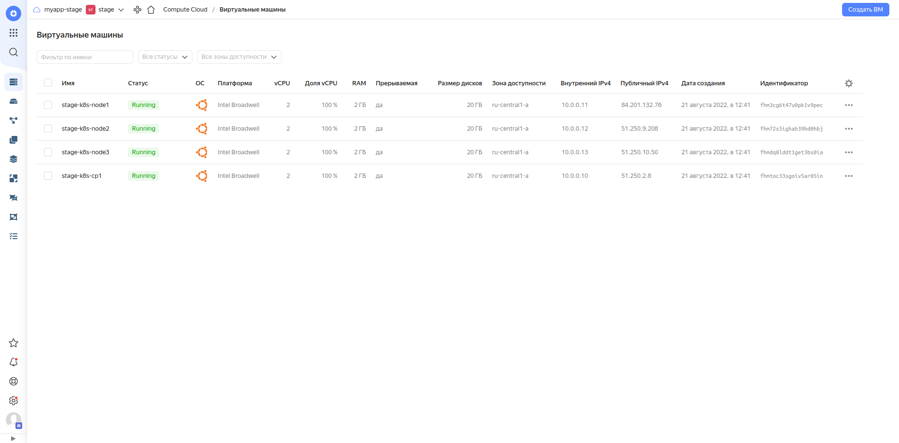

# Описание выполнения дипломного блока

## Этапы выполнения:

1. Создание облачной инфраструктуры
2. Создание Kubernetes кластера
3. Создание тестового приложения
4. Подготовка cистемы мониторинга и деплой приложения
5. Установка и настройка CI/CD

## Описание процесса выполнения.

### 1. Создание облачной инфраструктуры

 - применен метод представления "инфраструктура как код". [Репозиторий](https://github.com/vovinet/infra-ft-cloud) с описанием инфраструктуры.
 - управление инфраструктурой реализовано посредством [terraform cloud](https://app.terraform.io/app/vovinet-netology/workspaces)
 - настроено автоматическое планирование и применение изменений по коммиту в репозиторий.
 - 

Скриншоты Terrafom Cloud:


Скриншот Yandex.Cloud:


Успешный статус таже видно в [репозитории](https://github.com/vovinet/infra-ft-cloud) на GitHub.

Работа с облаком производится посредством создания сервисной учётно записи c ролью compute.admin, создание keyfile и назначение на калог для размещения ресурсов:
yc iam key create --service-account-name stage-sa

Обновить IAM-токен (действует до 12 часов): ```yc iam create-token```

Полученный токен используется Terrafom Cloud с помощью Variables Set


  
### 2. Создание Kubernetes кластера

 - Kubernetes-кластер развернут с помощью [kubespray](https://github.com/kubernetes-sigs/kubespray). Использованные [инвентари](conf/kubespray/)

 ```
 PLAY RECAP **************************************************************************************************************************************************************************************************
cp1                        : ok=748  changed=142  unreachable=0    failed=0    skipped=1247 rescued=0    ignored=9   
localhost                  : ok=3    changed=0    unreachable=0    failed=0    skipped=0    rescued=0    ignored=0   
node1                      : ok=474  changed=87   unreachable=0    failed=0    skipped=729  rescued=0    ignored=2   

Суббота 23 июля 2022  22:38:07 +0300 (0:00:00.063)       0:18:29.217 ********** 
=============================================================================== 
kubernetes-apps/ansible : Kubernetes Apps | Start Resources ----------------------------------------------------------------------------------------------------------------------------------------- 43.07s
kubernetes/kubeadm : Join to cluster ---------------------------------------------------------------------------------------------------------------------------------------------------------------- 34.11s
kubernetes/preinstall : Install packages requirements ----------------------------------------------------------------------------------------------------------------------------------------------- 32.90s
kubernetes/control-plane : kubeadm | Initialize first master ---------------------------------------------------------------------------------------------------------------------------------------- 29.64s
kubernetes/preinstall : Preinstall | wait for the apiserver to be running --------------------------------------------------------------------------------------------------------------------------- 29.18s
download : download_file | Validate mirrors --------------------------------------------------------------------------------------------------------------------------------------------------------- 28.96s
kubernetes-apps/ansible : Kubernetes Apps | Lay Down CoreDNS templates ------------------------------------------------------------------------------------------------------------------------------ 23.05s
network_plugin/calico : Calico | Create calico manifests -------------------------------------------------------------------------------------------------------------------------------------------- 16.19s
download : download_container | Download image if required ------------------------------------------------------------------------------------------------------------------------------------------ 14.81s
kubernetes-apps/ansible : Kubernetes Apps | Lay Down nodelocaldns Template -------------------------------------------------------------------------------------------------------------------------- 14.13s
network_plugin/calico : Start Calico resources ------------------------------------------------------------------------------------------------------------------------------------------------------ 14.07s
download : download_container | Download image if required ------------------------------------------------------------------------------------------------------------------------------------------ 12.60s
kubernetes/preinstall : Update package management cache (APT) --------------------------------------------------------------------------------------------------------------------------------------- 11.49s
download : check_pull_required |  Generate a list of information about the images on a node --------------------------------------------------------------------------------------------------------- 10.77s
download : download_container | Download image if required ------------------------------------------------------------------------------------------------------------------------------------------- 9.99s
etcd : reload etcd ----------------------------------------------------------------------------------------------------------------------------------------------------------------------------------- 9.09s
download : download_container | Download image if required ------------------------------------------------------------------------------------------------------------------------------------------- 8.17s
download : download_container | Download image if required ------------------------------------------------------------------------------------------------------------------------------------------- 8.10s
download : download_container | Download image if required ------------------------------------------------------------------------------------------------------------------------------------------- 7.89s
download : download_container | Download image if required ------------------------------------------------------------------------------------------------------------------------------------------- 7.21s
```

После копирования и редиктирования конфига подключимся к кластеру с локальной машины:
```
$ kubectl cluster-info 
Kubernetes control plane is running at https://51.250.90.61:6443

To further debug and diagnose cluster problems, use 'kubectl cluster-info dump'.
$ kubectl get po -A -o wide
NAMESPACE     NAME                              READY   STATUS    RESTARTS      AGE   IP             NODE    NOMINATED NODE   READINESS GATES
kube-system   calico-node-b7bqc                 1/1     Running   0             15h   10.0.0.11      node1   <none>           <none>
kube-system   calico-node-f7nzq                 1/1     Running   0             15h   10.0.0.10      cp1     <none>           <none>
kube-system   coredns-666959ff67-bng7h          1/1     Running   0             15h   10.233.110.1   cp1     <none>           <none>
kube-system   coredns-666959ff67-jh6lx          1/1     Running   0             15h   10.233.90.1    node1   <none>           <none>
kube-system   dns-autoscaler-59b8867c86-5dlxq   1/1     Running   0             15h   10.233.110.2   cp1     <none>           <none>
kube-system   kube-apiserver-cp1                1/1     Running   2 (15h ago)   15h   10.0.0.10      cp1     <none>           <none>
kube-system   kube-controller-manager-cp1       1/1     Running   2 (15h ago)   15h   10.0.0.10      cp1     <none>           <none>
kube-system   kube-proxy-7cpbp                  1/1     Running   0             15h   10.0.0.10      cp1     <none>           <none>
kube-system   kube-proxy-djjr4                  1/1     Running   0             15h   10.0.0.11      node1   <none>           <none>
kube-system   kube-scheduler-cp1                1/1     Running   2 (15h ago)   15h   10.0.0.10      cp1     <none>           <none>
kube-system   nodelocaldns-6cpqr                1/1     Running   0             15h   10.0.0.11      node1   <none>           <none>
kube-system   nodelocaldns-g7gjw                1/1     Running   0             15h   10.0.0.10      cp1     <none>           <none>
```

### 3. Создание тестового приложения

В качестве тестового приложения был выбран nginx, отдающий тестовую страницу. Репозиторий с Dockerfile, конфигом, отдаваемым контентом и пайплайном ci доступны в [репозитории](https://gitlab.com/vovinet/docker-app)  
Скриншот репозитория, на нём также видно отметку об успешной сборке.


Реестр контейнеров:
```
https://gitlab.com/vovinet/docker-app/container_registry/
```


### 4. Подготовка cистемы мониторинга и деплой приложения

### 5. Установка и настройка CI/CD